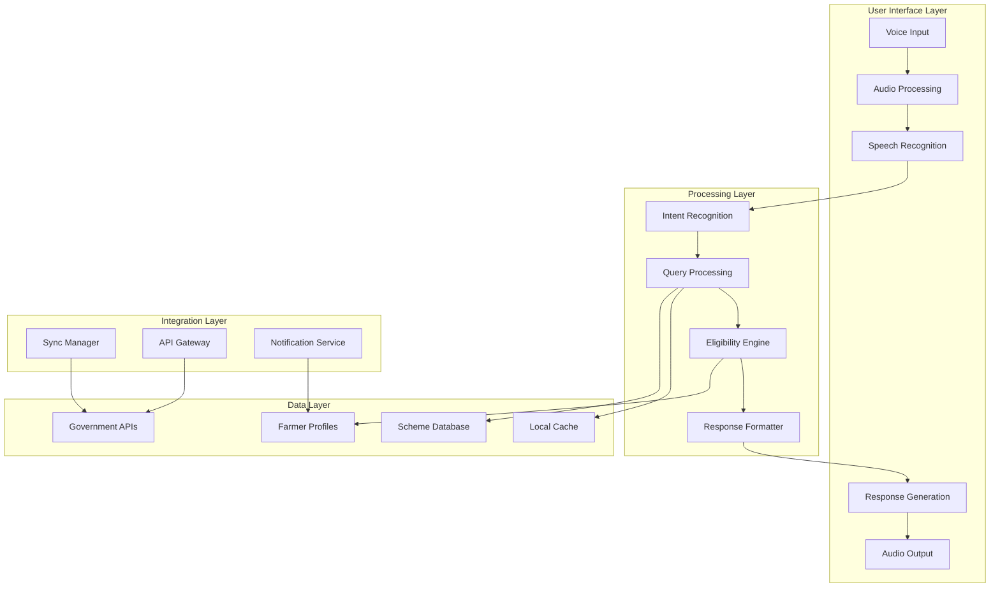

# Design Document: Farmer Voice Assistant

## Overview

The Farmer Voice Assistant is a comprehensive voice-first AI system designed to bridge the digital divide for Indian farmers accessing government scheme information. The system leverages cutting-edge multilingual speech recognition, natural language processing, and edge computing to provide accessible, reliable, and personalized assistance in local languages.

The architecture prioritizes offline-first functionality to address rural connectivity challenges while maintaining seamless integration with government systems and real-time data sources. The system employs a hybrid cloud-edge approach, utilizing on-device processing for core voice interactions and cloud services for complex queries and data synchronization.

## Architecture

### High-Level Architecture



### Component Architecture

The system follows a modular architecture with clear separation of concerns:

1. **Voice Processing Module**: Handles speech-to-text and text-to-speech operations
2. **Language Processing Module**: Manages multilingual understanding and response generation
3. **Business Logic Module**: Implements scheme matching, eligibility assessment, and recommendations
4. **Data Management Module**: Handles caching, synchronization, and persistence
5. **Integration Module**: Manages external API connections and government system integration

## Components and Interfaces

### Voice Processing Component

**Speech Recognition Engine**
- Utilizes state-of-the-art multilingual ASR models optimized for Indian languages
- Supports 10 major Indian languages with dialect variations
- Implements noise reduction and voice enhancement for rural environments
- Provides confidence scoring for recognition accuracy

**Text-to-Speech Engine**
- Generates natural-sounding speech in local languages
- Supports regional pronunciation patterns and number systems
- Implements adaptive speech rate based on user preferences
- Provides emotional tone modulation for better user experience

**Audio Processing Pipeline**
- Real-time noise cancellation and echo suppression
- Voice activity detection to optimize processing
- Audio quality enhancement for low-quality input devices
- Bandwidth-adaptive audio compression for poor connectivity

### Language Processing Component

**Intent Recognition System**
- Natural language understanding for conversational queries
- Context-aware intent classification across multiple languages
- Support for code-switching and mixed-language inputs
- Fallback mechanisms for ambiguous or unclear intents

**Multilingual Response Generator**
- Template-based response generation with dynamic content insertion
- Language-specific formatting for numbers, dates, and currency
- Cultural context adaptation for appropriate communication style
- Simplified language generation for complex technical information

### Business Logic Component

**Scheme Information Manager**
- Comprehensive database of central and state government schemes
- Real-time updates from official government sources
- Hierarchical categorization by scheme type, beneficiary, and region
- Version control and change tracking for scheme modifications

**Eligibility Assessment Engine**
- Rule-based eligibility evaluation using farmer profile data
- Multi-criteria decision making for complex eligibility requirements
- Confidence scoring for eligibility assessments
- Alternative scheme suggestions for ineligible farmers

**Recommendation System**
- Machine learning-based personalized recommendations
- Priority scoring based on benefit value and application deadlines
- Seasonal scheme awareness and proactive notifications
- Learning from user interactions to improve recommendations

### Data Management Component

**Local Data Cache**
- SQLite-based local storage for offline functionality
- Intelligent caching strategy prioritizing frequently accessed data
- Automatic cache invalidation and refresh mechanisms
- Compression and optimization for storage-constrained devices

**Farmer Profile Manager**
- Secure storage of farmer demographic and agricultural data
- Privacy-preserving data handling with encryption at rest
- Profile versioning and change history tracking
- Data export and portability features for user control

**Synchronization Manager**
- Intelligent sync scheduling based on connectivity availability
- Delta synchronization to minimize data transfer
- Conflict resolution for concurrent data modifications
- Offline queue management for pending operations

## Data Models

### Core Data Structures

**Farmer Profile**
```
FarmerProfile {
  id: String (unique identifier)
  personalInfo: {
    name: String
    phoneNumber: String
    aadhaarNumber: String (encrypted)
    address: Address
    preferredLanguage: LanguageCode
  }
  farmingInfo: {
    landSize: Number (in acres)
    landType: Enum [Irrigated, Rainfed, Mixed]
    cropTypes: Array<CropType>
    farmingPractices: Array<PracticeType>
    livestockCount: Number
    farmEquipment: Array<EquipmentType>
  }
  eligibilityCache: {
    lastUpdated: Timestamp
    eligibleSchemes: Array<SchemeId>
    ineligibleSchemes: Array<SchemeId>
  }
  preferences: {
    notificationSettings: NotificationPreferences
    voiceSettings: VoiceSettings
  }
}
```

**Government Scheme**
```
GovernmentScheme {
  id: String (unique identifier)
  name: MultilingualText
  description: MultilingualText
  category: SchemeCategory
  eligibilityCriteria: Array<EligibilityRule>
  benefits: Array<Benefit>
  applicationProcess: Array<ApplicationStep>
  documents: Array<DocumentRequirement>
  deadlines: {
    applicationStart: Date
    applicationEnd: Date
    benefitDistribution: Date
  }
  coverage: {
    states: Array<StateCode>
    districts: Array<DistrictCode>
    applicableCategories: Array<FarmerCategory>
  }
  lastUpdated: Timestamp
  source: String (government portal URL)
}
```

**Voice Interaction Session**
```
VoiceSession {
  sessionId: String
  farmerId: String
  startTime: Timestamp
  endTime: Timestamp
  language: LanguageCode
  interactions: Array<{
    timestamp: Timestamp
    userInput: String (transcribed)
    systemResponse: String
    intent: IntentType
    confidence: Number
    contextData: Object
  }>
  outcome: SessionOutcome
  satisfaction: Number (1-5 scale)
}
```

### Database Schema Design

The system employs a hybrid storage approach:
- **Local SQLite Database**: Stores farmer profiles, cached scheme data, and session history
- **Cloud Database**: Maintains master scheme database, analytics, and cross-device synchronization
- **Government API Integration**: Real-time access to official scheme databases and application portals

## Correctness Properties

*A property is a characteristic or behavior that should hold true across all valid executions of a system—essentially, a formal statement about what the system should do. Properties serve as the bridge between human-readable specifications and machine-verifiable correctness guarantees.*

Before defining the correctness properties, let me analyze the acceptance criteria from the requirements to determine which are testable as properties.

Based on the prework analysis, the following correctness properties ensure the system meets its requirements:

**Property 1: Multilingual Voice Processing**
*For any* supported Indian language (Hindi, Tamil, Telugu, Marathi, Bengali, Gujarati, Kannada, Malayalam, Punjabi, Odia), the Voice_Assistant should successfully recognize and process voice queries in that language
**Validates: Requirements 1.1, 2.1**

**Property 2: Noise-Robust Voice Recognition**
*For any* voice input with background noise, the Voice_Assistant should filter the noise and extract the farmer's voice with accuracy above the baseline threshold
**Validates: Requirements 1.2**

**Property 3: Dialect Variation Handling**
*For any* regional dialect variation of a supported language, the Voice_Assistant should interpret the intent correctly and consistently
**Validates: Requirements 1.3**

**Property 4: Language Consistency**
*For any* voice interaction, if the farmer speaks in language X, then all system responses and clarification questions should be in language X
**Validates: Requirements 1.4, 2.3**

**Property 5: Language Switching Detection**
*For any* conversation where the farmer switches from language X to language Y, the Voice_Assistant should detect the change and respond in language Y
**Validates: Requirements 2.2**

**Property 6: Language Preference Persistence**
*For any* farmer with a set language preference, all future interactions should default to that preferred language until explicitly changed
**Validates: Requirements 2.5**

**Property 7: Scheme Information Accuracy**
*For any* query about available schemes, the Voice_Assistant should provide information that matches the current state of the Scheme_Database
**Validates: Requirements 3.1**

**Property 8: Scheme Information Completeness**
*For any* request for scheme details, the response should include eligibility criteria, benefits, application process, and deadlines
**Validates: Requirements 3.2**

**Property 9: Category-Based Filtering**
*For any* scheme category query, all returned schemes should belong to the requested category and no schemes from other categories should be included
**Validates: Requirements 3.3**

**Property 10: Application Guidance Completeness**
*For any* scheme application request, the guidance should include all necessary steps required to complete the application
**Validates: Requirements 3.5**

**Property 11: Profile Data Storage**
*For any* farmer profile information provided (crop types, land size, location, farming practices), all data should be correctly stored and retrievable
**Validates: Requirements 4.1**

**Property 12: Eligibility-Based Recommendations**
*For any* farmer profile, all recommended schemes should match the farmer's eligibility criteria according to the Eligibility_Engine
**Validates: Requirements 4.2, 5.1**

**Property 13: Recommendation Prioritization**
*For any* set of applicable schemes for a farmer, recommendations should be ordered by potential benefit value and application deadline proximity
**Validates: Requirements 4.3**

**Property 14: Profile Update Propagation**
*For any* change to a farmer's profile, the recommendation list should be updated to reflect the new eligibility status
**Validates: Requirements 4.4, 5.5**

**Property 15: Seasonal Scheme Notifications**
*For any* new seasonal scheme that becomes available, all eligible farmers should receive proactive notifications
**Validates: Requirements 4.5**

**Property 16: Ineligibility Explanation**
*For any* scheme where a farmer is ineligible, the response should identify which specific requirements are missing and suggest alternative schemes
**Validates: Requirements 5.2**

**Property 17: Conditional Eligibility Handling**
*For any* scheme with partial farmer eligibility, the response should explain the conditional requirements and next steps
**Validates: Requirements 5.3**

**Property 18: Information Gathering for Eligibility**
*For any* eligibility assessment requiring additional information, the Voice_Assistant should ask specific questions to complete the evaluation
**Validates: Requirements 5.4**

**Property 19: Offline Mode Functionality**
*For any* voice query when internet connectivity is unavailable, the Voice_Assistant should operate using cached data and inform the farmer of offline status
**Validates: Requirements 7.1, 7.3**

**Property 20: Data Synchronization**
*For any* restoration of internet connectivity, the Voice_Assistant should synchronize with the Scheme_Database and update cached information
**Validates: Requirements 7.2**

**Property 21: Connectivity-Aware Processing**
*For any* voice processing request when cloud connectivity is limited, the Voice_Assistant should fallback to on-device processing capabilities
**Validates: Requirements 7.5**

**Property 22: Data Protection**
*For any* personal information provided by farmers, the data should be encrypted during storage, deleted after processing (for voice recordings), and only necessary information should be transmitted to government systems
**Validates: Requirements 9.1, 9.2, 9.4**

**Property 23: Consent Collection**
*For any* farmer profile creation, explicit consent should be obtained before collecting and storing personal data
**Validates: Requirements 9.3**

**Property 24: Data Deletion Compliance**
*For any* farmer data deletion request, all personal information should be removed within 30 days
**Validates: Requirements 9.5**

**Property 25: Application Process Guidance**
*For any* scheme application, the Voice_Assistant should provide complete step-by-step guidance and collect all required information through voice interaction
**Validates: Requirements 10.1, 10.2**

**Property 26: Government Portal Integration**
*For any* completed application, the Voice_Assistant should successfully submit it to the appropriate government portal
**Validates: Requirements 10.3**

**Property 27: Localized Response Generation**
*For any* voice response, the speech should be generated in the farmer's preferred language using appropriate local pronunciation conventions for numbers and technical terms
**Validates: Requirements 11.1, 11.4**

**Property 28: Response Structure and Control**
*For any* complex information delivery, responses should be broken into digestible segments, support repetition requests, and offer pause options for lengthy content
**Validates: Requirements 11.2, 11.3, 11.5**

**Property 29: Response Time Performance**
*For any* voice query, cached information should be provided within 3 seconds and real-time scheme data within 10 seconds
**Validates: Requirements 12.2, 12.3**

## Error Handling

The system implements comprehensive error handling across all components:

**Voice Processing Errors**
- Speech recognition failures trigger clarification requests in the user's language
- Audio quality issues prompt users to repeat their query or move to a quieter location
- Unsupported language detection provides guidance on available language options
- Timeout handling for long pauses in user speech

**Data Access Errors**
- Network connectivity issues trigger offline mode with cached data
- Government API failures provide cached information with staleness warnings
- Database corruption triggers automatic repair and backup restoration
- Sync conflicts are resolved using timestamp-based precedence rules

**Business Logic Errors**
- Invalid farmer profile data triggers validation error messages with correction guidance
- Scheme eligibility calculation errors provide fallback to manual review processes
- Recommendation engine failures default to basic scheme listing by category
- Application submission errors provide retry mechanisms and alternative submission methods

**Security and Privacy Errors**
- Encryption failures prevent data storage and trigger secure fallback procedures
- Consent validation errors block profile creation until proper consent is obtained
- Data deletion failures trigger escalation to manual review processes
- Unauthorized access attempts are logged and blocked with user notification

## Testing Strategy

The system employs a comprehensive dual testing approach combining unit tests for specific scenarios and property-based tests for universal correctness validation.

**Property-Based Testing Configuration**
- Framework: Hypothesis (Python) for comprehensive property validation
- Test iterations: Minimum 100 iterations per property to ensure statistical confidence
- Each property test references its corresponding design document property
- Tag format: **Feature: farmer-voice-assistant, Property {number}: {property_text}**

**Unit Testing Focus Areas**
- Specific language processing examples and edge cases
- Integration points between voice processing and business logic components
- Error condition handling and recovery mechanisms
- Government API integration scenarios
- Security and privacy compliance validation

**Testing Environment Setup**
- Multilingual test data generation for all supported Indian languages
- Simulated network conditions for offline/online mode testing
- Mock government API responses for integration testing
- Synthetic voice data generation for speech recognition testing
- Performance benchmarking under various load conditions

**Continuous Integration Requirements**
- All property tests must pass before deployment
- Performance benchmarks must meet specified response time requirements
- Security scans must pass for data protection compliance
- Multilingual functionality must be validated across all supported languages
- Offline mode functionality must be verified in isolated network conditions

The testing strategy ensures that the voice assistant maintains high reliability, accuracy, and user satisfaction across diverse usage scenarios and technical conditions encountered in rural Indian environments.

## MVP Implementation for Hackathon

For the hackathon prototype, the following parts are implemented:

- Voice input using browser speech API  
- Multilingual query handling  
- AI-based scheme retrieval  
- Text + voice responses  

Other components described in this design document represent the planned production architecture and future roadmap.
